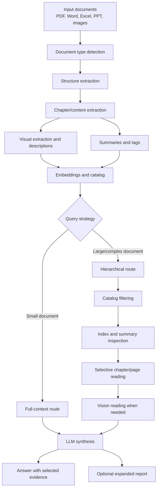

# Architecture Diagram

```mermaid
flowchart TD
    A[Input documents<br/>PDF, Word, Excel, PPT, images] --> B[Document type detection]
    B --> C[Structure extraction]
    C --> D[Chapter/content extraction]
    D --> E[Visual extraction and descriptions]
    D --> F[Summaries and tags]
    E --> G[Embeddings and catalog]
    F --> G

    G --> H{Query strategy}

    H -->|Small document| I[Full-context route]
    H -->|Large/complex document| J[Hierarchical route]

    J --> K[Catalog filtering]
    K --> L[Index and summary inspection]
    L --> M[Selective chapter/page reading]
    M --> N[Vision reading when needed]

    I --> O[LLM synthesis]
    N --> O

    O --> P[Answer with selected evidence]
    O --> Q[Optional expanded report]
```
