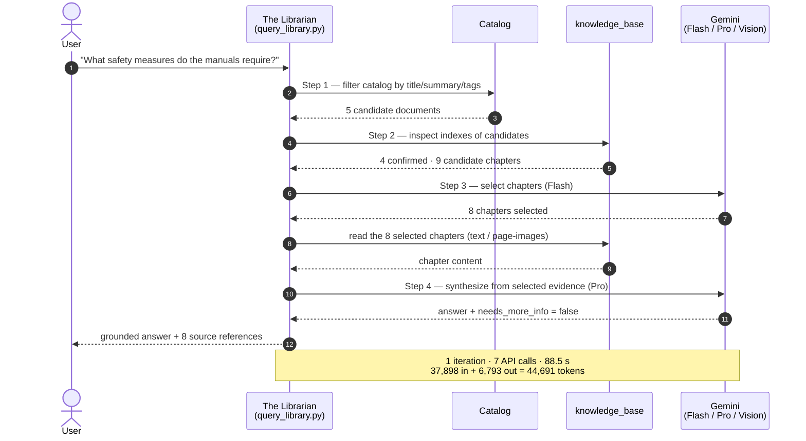

# Retrieval Sequence — "The Librarian"

The 4-step query funnel, annotated with the real numbers from **Run B** (the cross-document
*"safety measures"* query). Source: [`../artifacts/query-trace.safety.json`](../artifacts/query-trace.safety.json).

Run A (single 59-chapter book, *"power zones"*) follows the same path with a narrower funnel:
1 → 1 document, 6 → 5 chapters, 6 API calls, 73.7 s, 52,786 tokens. See
[`../retrieval-flow.md`](../retrieval-flow.md) for both side by side.
