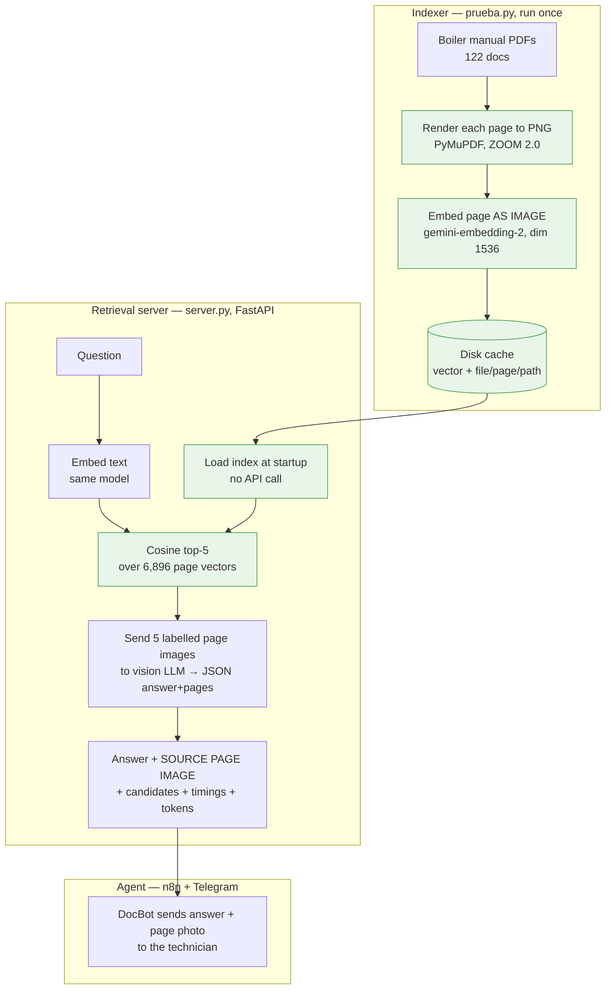

# Architecture Diagram

```mermaid
flowchart TD
    subgraph IDX[Indexer — prueba.py, run once]
        A[Boiler manual PDFs<br/>122 docs] --> B[Render each page to PNG<br/>PyMuPDF, ZOOM 2.0]
        B --> C[Embed page AS IMAGE<br/>gemini-embedding-2, dim 1536]
        C --> D[(Disk cache<br/>vector + file/page/path)]
    end

    subgraph SRV[Retrieval server — server.py, FastAPI]
        D --> E[Load index at startup<br/>no API call]
        Q[Question] --> F[Embed text<br/>same model]
        F --> G[Cosine top-5<br/>over 6,896 page vectors]
        E --> G
        G --> H[Send 5 labelled page images<br/>to vision LLM → JSON answer+pages]
        H --> I[Answer + SOURCE PAGE IMAGE<br/>+ candidates + timings + tokens]
    end

    subgraph UI[Agent — n8n + Telegram]
        I --> J[DocBot sends answer + page photo<br/>to the technician]
    end

    classDef det fill:#e8f5e9,stroke:#43a047;
    class B,C,D,E,G det;
```

Green = deterministic (rendering, caching, cosine search). The embedding and the answer are the model;
the retrieval core (green) is what the [demo](../demo/) runs offline.
