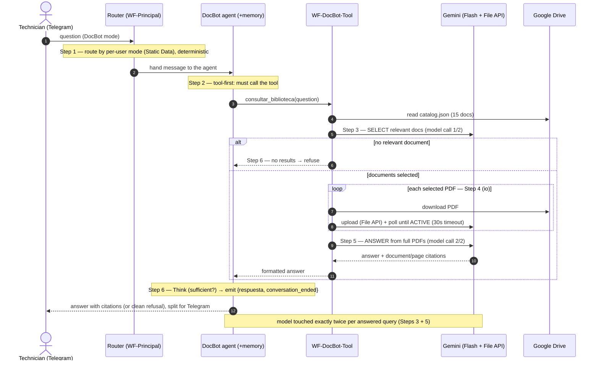

# The agent loop — Sequence

Step numbers match [agent-loop.md](../agent-loop.md), the README and `demo/run_demo.py`.

Recorded runs (tool-path vs refuse-path) and the honest metric gap:
[`artifacts/query-runs.json`](../artifacts/query-runs.json).
