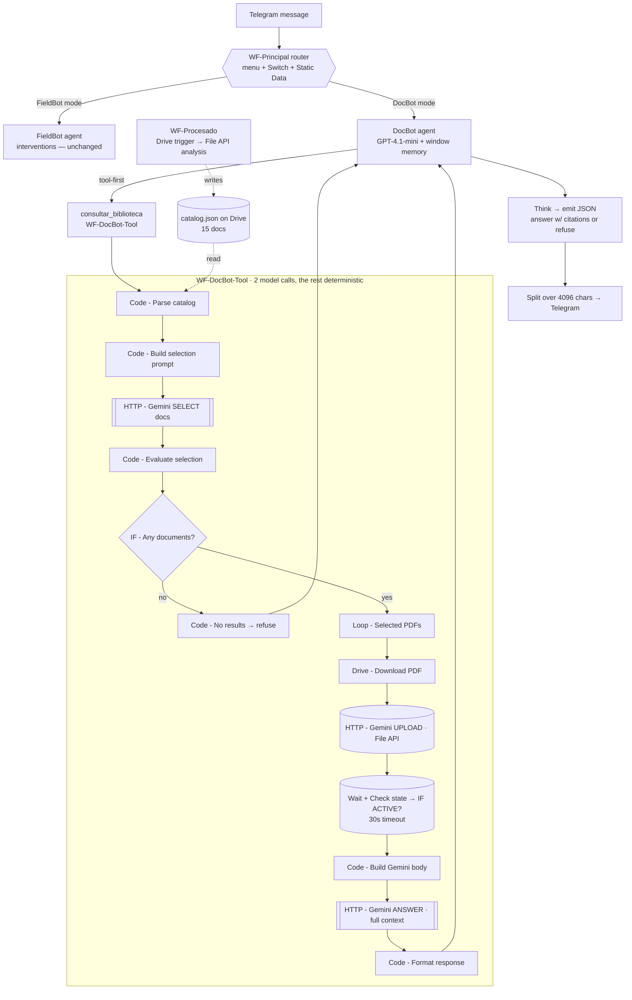

# Architecture Diagram

The boundary in colour: blue = deterministic n8n nodes, red = the 2 model calls, grey = io.

Legend: `[[ ]]` = the **2 LLM judgment calls** · `( )` = io / File API · `{{ }}` `{ }` = deterministic
routing. Full per-node boundary table:
[`artifacts/tool-structure.json`](../artifacts/tool-structure.json).
