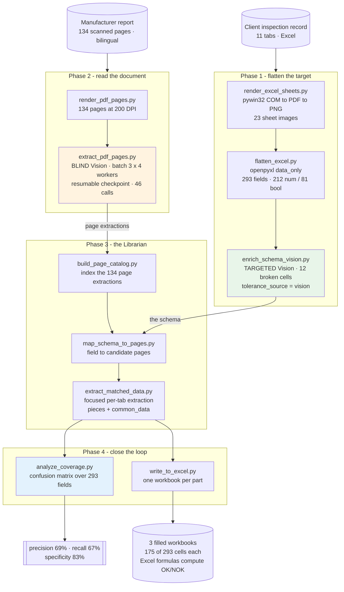

# Architecture Diagram

**Green** is the targeted Vision run, **orange** the blind one — the same model asked two different
questions, with opposite failure profiles ([../the-bug-i-fixed.md](../the-bug-i-fixed.md)). **Blue**
is the step that makes the whole thing measurable rather than merely finished: nothing is "done"
until the coverage matrix classifies every one of the 293 fields.

Deterministic stages (rendering, cataloguing, the coverage arithmetic, the Excel write-back) are
separated from the two model-driven stages on purpose; the model reads, the code decides.
