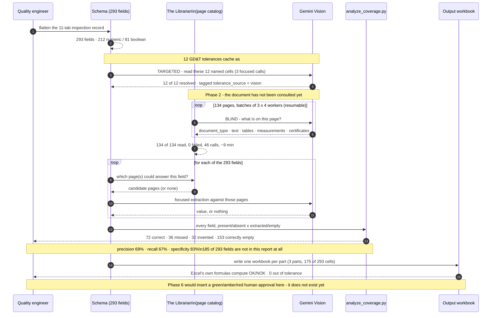

# Extraction Sequence

The two Vision interactions are deliberately drawn differently. The **targeted** one names its
fields and resolves 12 of 12. The **blind** one reads every page and succeeds at reading — but the
values still have to be matched back to fields afterwards, and that later matching step is where all
32 false positives are produced. Knowing the schema before asking the question is the difference.
