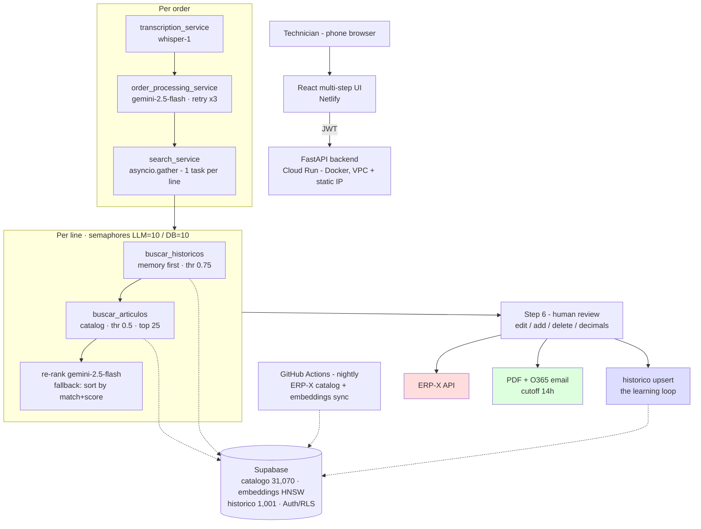

# Architecture Diagram

The three delivery channels (bottom) fail independently — each has its own status light and its own
`SIMULATE_FAILURE` injection point ([`artifacts/chaos-degradation.json`](../artifacts/chaos-degradation.json)).
