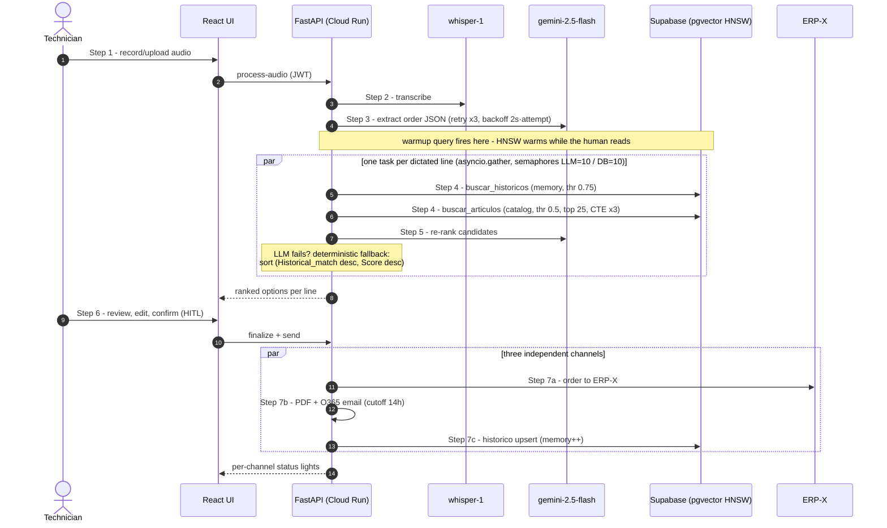

# The request flow — Sequence

Step numbers match [request-flow.md](../request-flow.md), the README and `demo/run_demo.py`.

Real recorded run for Steps 2–3: the 21-line dictated order in
[`artifacts/extraction-examples.json`](../artifacts/extraction-examples.json). Per-request latency was
not archived — see [../EVALUATION.md](../EVALUATION.md).
