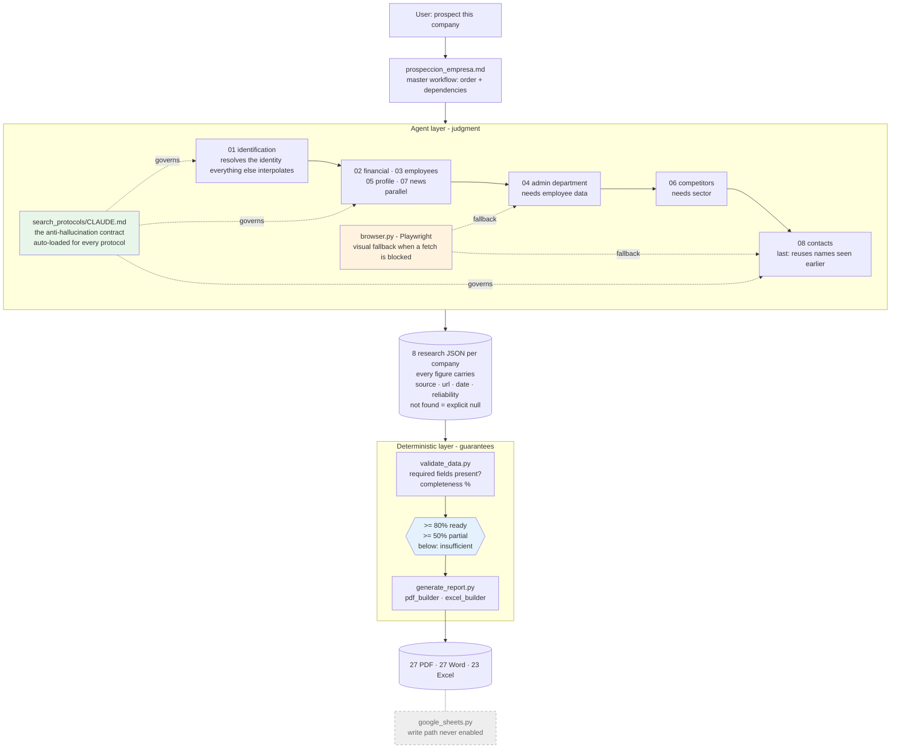

# Architecture Diagram

**Green** is the contract — it governs every protocol because it lives in the protocols' own folder,
not in a prompt someone has to remember. **Blue** is the gate: dumb arithmetic over field presence,
deliberately sharing none of the failure modes of the layer it judges. **Orange** is the fallback
that exists because the sources holding people data refuse automated fetches.

The greyed box is real and deliberately inert: the CRM integration was built but its write path was
never switched on, so nothing automated has ever modified the real CRM.
