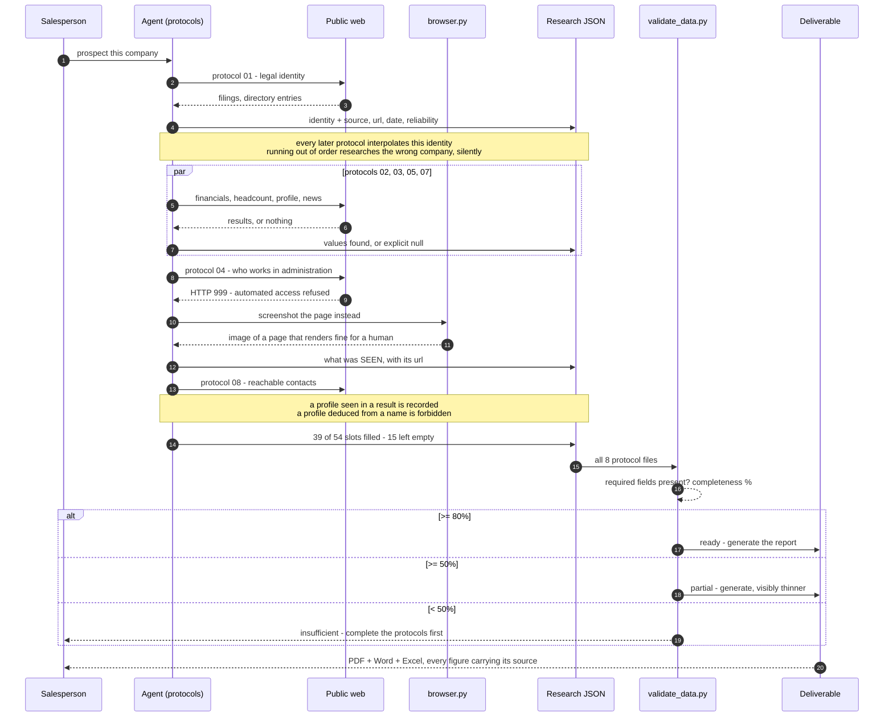

# Workflow Sequence

The two moments that define this workflow are steps 8–11 and the `alt` block. In the first, the
deterministic route fails and the agent is given sight rather than permission to guess. In the
second, a piece of arithmetic that knows nothing about companies decides whether a human should act
on what the agent produced.
