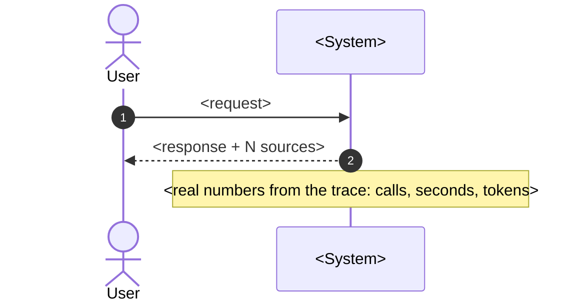

<!-- RENAME per case (retrieval-sequence.md / agent-loop-sequence.md ...). Annotate with REAL numbers from a trace. -->
# <Main flow> — Sequence

```mermaid
sequenceDiagram
    autonumber
    actor U as User
    participant S as <System>
    U->>S: <request>
    S-->>U: <response + N sources>
    Note over S: <real numbers from the trace: calls, seconds, tokens>
```
